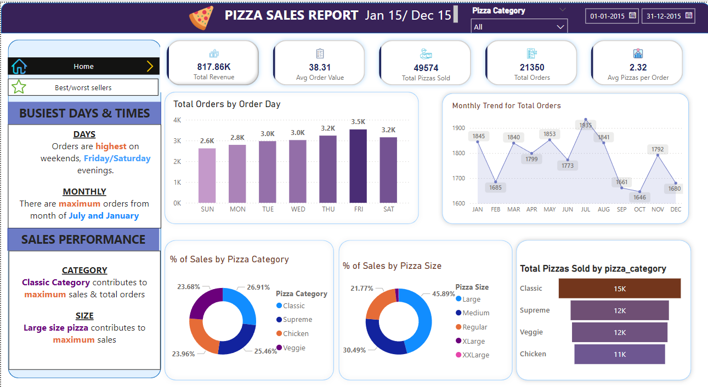
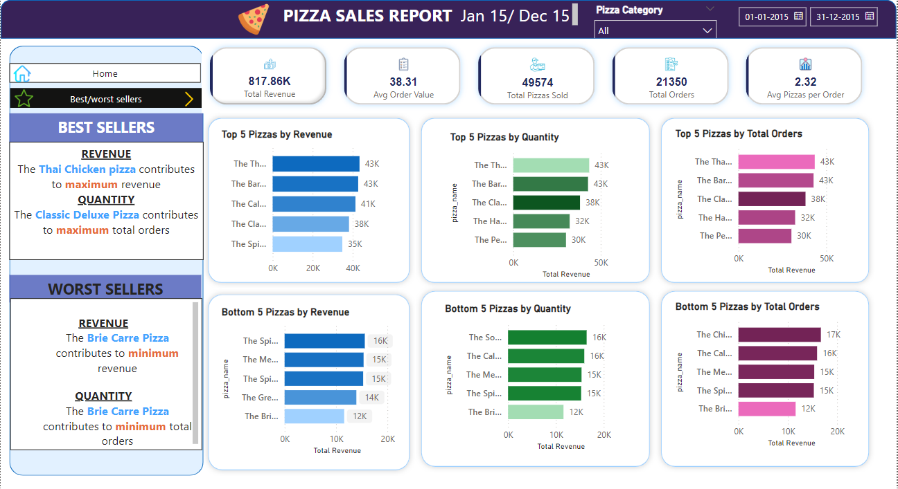

# Pizza Sales Dashboard
## Overview
This project demonstrates the creation of an interactive and visually appealing sales dashboard using Power BI. The dashboard provides actionable insights into pizza sales, helping stakeholders identify trends, improve operational efficiency, and make data-driven decisions.

## Project Objectives
The primary objectives of this project are:

-To analyze sales trends and identify peak business times.
-To evaluate the performance of pizza categories and sizes.
-To identify the top and bottom-performing pizzas by revenue and quantity.
-To enable better decision-making with clear and concise KPIs.

## Key Insights from the Dashboard

## 1. Key Performance Indicators (KPIs):
Total Revenue: $817.86K
Average Order Value: $38.31
Total Pizzas Sold: 49,574
Total Orders: 21,350
Average Pizzas per Order: 2.32

## 2. Sales Trends:
Busiest Days: Sales are highest on weekends, particularly Friday and Saturday evenings.
Peak Months: Maximum orders are observed in July and January.

## 3. Performance by Category and Size:
Pizza Categories: The Classic category contributes the most to total sales and revenue.
Pizza Sizes: Large-size pizzas are the most popular and contribute the highest sales.

## 4. Best and Worst Sellers:
-Top Performer by Revenue: Thai Chicken Pizza ($43K).
-Top Performer by Quantity: Classic Deluxe Pizza.
-Lowest Performer by Revenue and Quantity: Brie Carre Pizza.

## Dashboard Features
## Home Page:
KPIs: Displays total revenue, average order value, and other business metrics.
## Visuals:
-Bar chart for total orders by day.
-Line chart showing monthly trends for total orders.
-Pie charts displaying sales distribution by pizza category and size.
-Best/Worst Sellers Page:
-Top 5 and Bottom 5 Pizzas by Revenue, Quantity, and Total Orders:
-Highlights the best and least-performing pizzas to assist in inventory and marketing decisions.

## Filters and Slicers:
Date Range Filter: Analyze data for specific time periods.
Pizza Category Filter: Focus on specific pizza categories (Classic, Supreme, Veggie, Chicken).
Technical Implementation

## Dataset Used:
The dataset includes:

Order details (date, day, month).
Product details (pizza name, category, size).
Sales metrics (quantity, revenue).
Data Preparation in Power BI:
Cleaned data using Power Query (removed duplicates, handled null values).
Created calculated columns for Month and Day from the order date.
Built measures using DAX for KPIs and trends.

# DAX Measures:
## Below are some key measures used:

Total Revenue = SUM(pizza_sales[total_price])
Avg Order Value = [Total Revenue]/[Total Orders]  
Avg Pizzas per Order = [Total Pizzas Sold]/[Total Orders] 
Total Orders = DISTINCTCOUNT(pizza_sales[order_id])
Total Pizzas Sold = SUM(pizza_sales[quantity])

## How to Use the Dashboard

## Download the Power BI File:
Clone this repository and download the Pizza_Sales_Dashboard.pbix file.

## Open in Power BI Desktop:
Install Power BI Desktop if you haven’t already.

## Explore the Dashboard:
Use interactive slicers to filter data by date range or pizza category.
Analyze visuals to gain insights into sales performance.

## Files in this Repository
Pizza_Sales_Dashboard.pbix: The Power BI file containing the dashboard.
dashboard_overview.png: Screenshot of the Home Page.
dashboard_overview2.png: Screenshot of the Best/Worst Sellers Page.
README.md: Documentation for the project.

## Future Enhancements
Incorporate customer feedback data for sentiment analysis.
Add delivery time metrics to analyze operational efficiency.
Explore advanced predictive analytics using Power BI's AI capabilities.

## Conclusion
This project showcases how Power BI can be leveraged to create an interactive and insightful sales dashboard. It highlights the importance of data visualization in understanding customer behavior, product performance, and operational trends.
